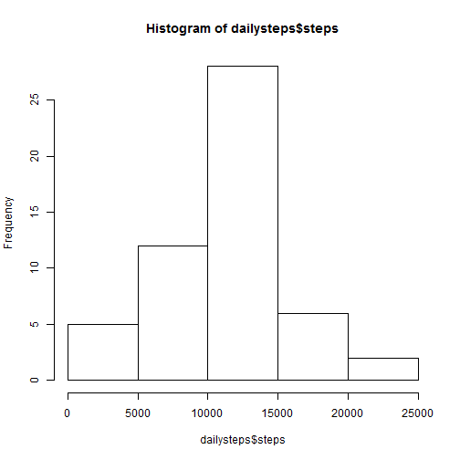
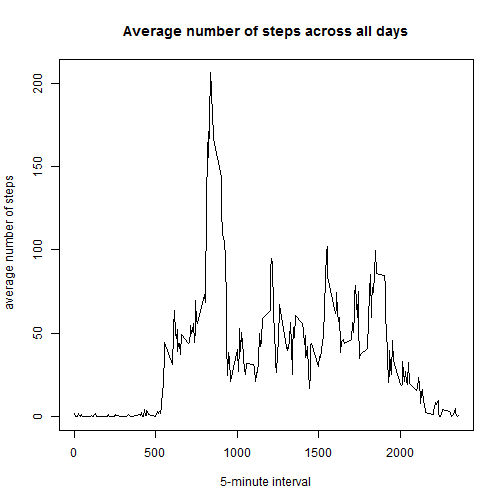
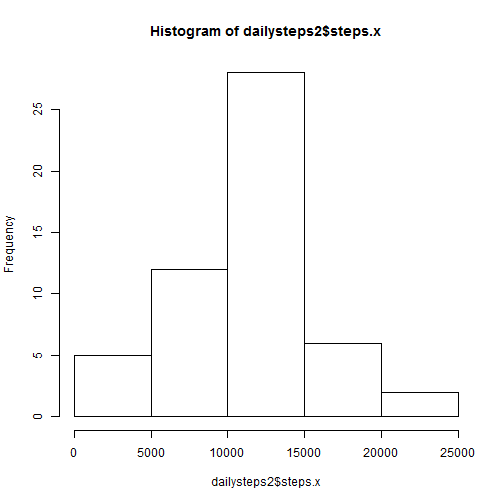
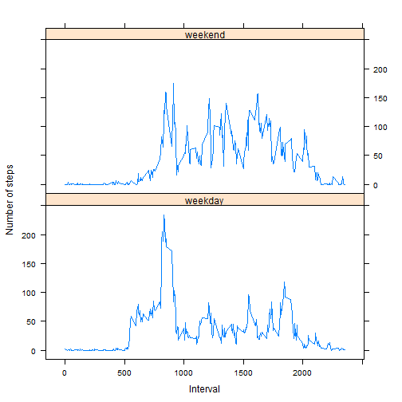

#Reproducible Research - Assessment 1
##Loading and preprocessing the data

```r
data<-read.csv("activity.csv",header = T)
data$date<-as.Date(data$date,"%Y-%m-%d")
cleandata = data[!is.na(data$steps), ]
```

##What is mean total number of steps taken per day?
The total number of steps taken per day

```r
dailysteps<-aggregate(steps~date, cleandata, sum)
```
A histogram of the total number of steps taken each day

```r
hist(dailysteps$steps)
```

 

The mean and median of the total number of steps taken per day

```r
stepmean<-mean(dailysteps$steps)
stepmedian<-median(dailysteps$steps)
```
The mean of total numbers of steps taken per day is 1.0766189 &times; 10<sup>4</sup> and the median is 10765.

##What is the average daily activity pattern?
A time series plot of the 5-minute interval and the average number of steps taken.

```r
intstep<-aggregate(steps~interval,cleandata,mean)
plot(intstep$interval,intstep$steps,type="l",xlab="5-minute interval",ylab=" average number of steps",main="Average number of steps across all days")
```

 

Which 5-minute interval,on average across all the days in the dateset,contains the max number of steps?

```r
maxId<-which.max(intstep$steps)
maxInterval<-intstep[maxId,]$interval
maxSteps<-intstep[maxId,]$steps
```
The answer: id is 104,interval is 835,steps is 206.1698113

##Imputing missing values

```r
totalna<-sum(is.na(data$steps))
```
The total number of missing values in the dataset: 2304  
Use the mean for the 5-minute interval to fill in all the missing values in the dataset, and create a new dataset called data2 with missing data filled in.

```r
data2<-merge(data,intstep,by = "interval")
data2$steps.y<-NULL
```
A histogram of the total number of steps taken each day.

```r
dailysteps2<-aggregate(steps.x~date, data2, sum)
hist(dailysteps2$steps.x)
```

 

The mean and median total number of steps taken per day of the new dataset

```r
stepmean2<-mean(dailysteps2$steps.x)
stepmedian2<-median(dailysteps2$steps.x)
```
The new mean is 1.0766189 &times; 10<sup>4</sup>,compared to old mean 1.0766189 &times; 10<sup>4</sup>  
The new median is 10765,compared to old median 1.0766189 &times; 10<sup>4</sup> 
With missing data filled in, in this case,mean is the same, while median is changed
##Are there differences in activity patterns between weekdays and weekends?
Create a new factor in dateset with two levels-"weekday" and "weekend"

```r
data2$date<-as.Date(data2$date,"%Y-%m-%d")
Sys.setlocale("LC_ALL", "C")
```

```
## [1] "C"
```

```r
data2$day<-weekdays(data2$date)
weekend<-data2$day=="Saturday"|data2$day=="Sunday"
data2$dw[weekend]<-"weekend"
data2$dw[!weekend]<-"weekday"
```

A panel plot containing a time series plot of the 5-minute interval and the average number of steps taken.

```r
nstep<-aggregate(steps.x~interval+dw,data2,mean)
library(lattice)
xyplot(steps.x~interval|dw,nstep,layout=c(1,2),type = "l",xlab="Interval",ylab="Number of steps")
```

 

The end
